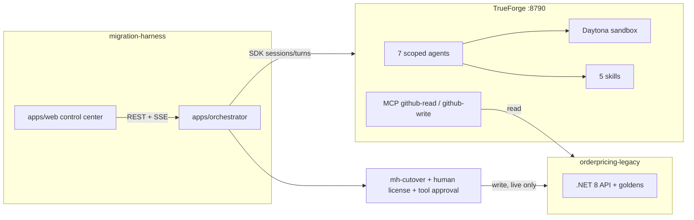

# MigrationHarness

### Prove the migration before you license the cutover.

**MigrationHarness autonomously modernizes a bounded .NET service into Rust — but generated
code does not earn authority simply by compiling.** The [TrueForge](https://trueforge.dev)
harness connects the real repository through MCP, executes generated code inside an isolated
Daytona sandbox, delegates discovery / migration / parity work to scoped specialist agents,
persists long-running migration state across reconnects, and **stops before canonical cutover
until a human licenses the exact verified migration manifest.**

> Compilation proves Rust syntax. MigrationHarness proves behavior.

This is the WeMakeDevs x TrueForge Agent Harness Hackathon submission.

## Pitch

A judge can film the control center:

1. Start a migration of `orderpricing-legacy` (`src/OrderPricing.Api`) to Rust/Axum.
2. Watch seven scoped TrueForge agents run: MCP `github-read`, sandbox `cargo`, parity.
3. See the decimal rounding trap (`.NET 170.00` vs `Rust 169.99`), then a bounded repair to 384/384.
4. Freeze a hash-bound manifest. **LICENSE MIGRATION** stays disabled if any gate is red.
5. Cutover pauses on a GitHub-write tool approval. Demo mode simulates that write.
6. Done: placeholder (demo) or real PR, license consumed, audit timeline.

Generated code never gets `github-write`. Only `mh-cutover` does, and only after a human licenses one SHA.

## Architecture

TrueForge owns the agent loop, Daytona, MCP, tool approvals, sessions/turns, and the SSE event stream.

The orchestrator owns only the migration state machine, nine quality gates, the manifest, the license, and sequencing.

`@mh/shared` owns the pure contract: zod types, gates, manifest hashing, license verification, state machine. Orchestrator, UI, and tests import the same code.

See [docs/architecture.md](docs/architecture.md) and [docs/safety-model.md](docs/safety-model.md).

### TrueForge usage

| Capability | How MigrationHarness uses it |
|---|---|
| MCP | mh-architect / mh-contract get github-read (@read-only). Only mh-cutover gets github-write. migrator/parity/repair/security have no MCP. |
| Sandbox | Generated Rust runs in Daytona. Demo mode simulates these events and never starts Daytona. |
| Subagents | Seven saved agents, one session per stage. Repair is bounded to 3 rounds. |
| Skills | dotnet-analysis, dotnet-to-rust, rust-axum, behavioral-parity, secure-migration. |
| Approval gates | Human licenses a hash-bound single-use manifest. GitHub write still pauses for a control-center checkpoint. Merge stays locked. |
| Session persistence | SQLite event store. The UI reconnects with after=seq. AgentGateway.resume re-attaches a running TrueForge turn. |

## Setup

### Demo mode (no keys) — film this

Copy env example to env. Enable the demo flag. Install, typecheck, test.

Start orchestrator and web workspaces, then open port 3000.

Leave Demo mode ON. Source acme/orderpricing-legacy, path src/OrderPricing.Api, target Rust/Axum.
Click START MIGRATION. DemoGateway is simulated: no live writes, no sandbox provider.

See docs/demo-script.md for the three-minute walkthrough.

### Live TrueForge

Launch the local TrueForge server. Configure a model, separate read/write MCP, sandbox provider, and skills.

Turn the demo flag off, sync agents, then start orchestrator and web.

## Layout

| Path | What |
|---|---|
| schemas/ | JSON Schemas for pipeline artifacts |
| packages/shared/ | Types, gates, manifest hashing, license verification, state machine |
| agents/ | 7 scoped TrueForge agent definitions |
| skills/ | Git-backed SKILL.md instruction packs |
| apps/orchestrator/ | Fastify: sequences sessions, evaluates gates, freezes the manifest |
| apps/web/ | Next.js 15 App Router control-center UI |
| sandbox/ | Isolated Python helpers for live sandbox runs |
| tests/ | Safety tests: no cutover without a valid unconsumed hash-matched license |
| docs/ | Architecture, safety model, demo script, review process |

## Qodo Code Review Evidence

Every substantive change lands through a reviewed pull request. No direct pushes to main.

- PR 2 (https://github.com/Yash-Kavaiya/migration-harness/pull/2): stacked agents PR. The agentic review found real bugs: overcounted / last-duplicate-wins byRoute tallies that could hide parity failures; skipped security checks treated as passing; MCP allowlists not pinned to each agent's full server + tool selector. Fixes landed, then agentic_review was re-run (commit trail 88b86e2, fa43a27, 19403d2).
- Follow-up review passes on later stacked PRs (4abf17f, 623ba33).
- [PR 9](https://github.com/Yash-Kavaiya/migration-harness/pull/9) — this submission. Opened against main; /agentic_review requested on the complete control-center.

Process: [docs/qodo.md](docs/qodo.md).

## AI coding assistants (hackathon disclosure)

This repository was built with AI coding assistants: Claude Code (Anthropic) and Cursor (Composer / Grok Bot). Humans directed the architecture, safety model, and review loop. Qodo Merge reviewed the pull requests.

## License

MIT

